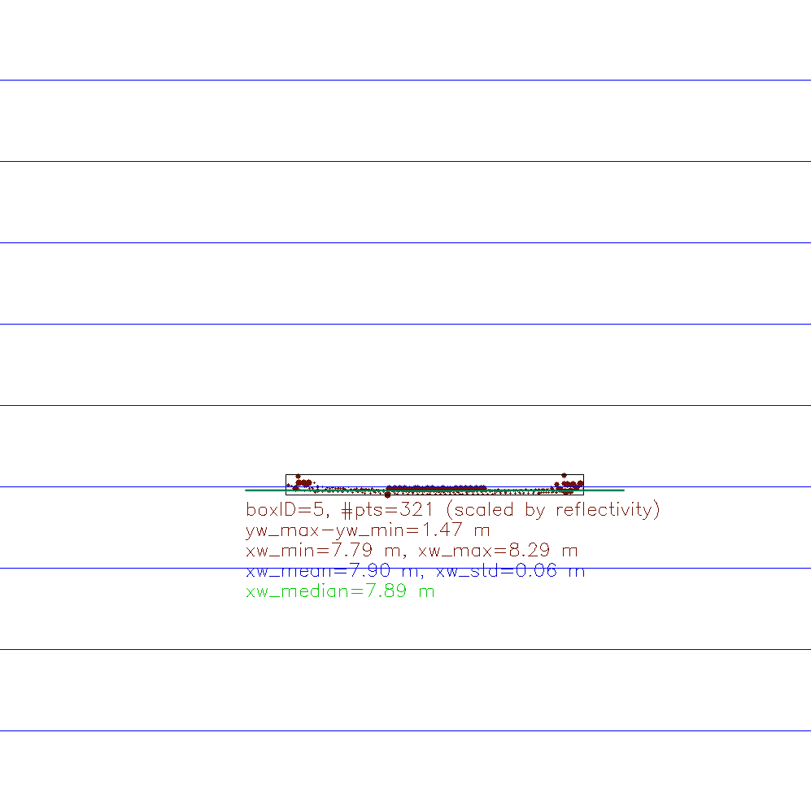

# SFND 3D Object Tracking
  
## Task
The idea of the final project of the camera course in Udacity's Sensor Fusion Nanodegree program is to build a collision detection system using Lidar and vision. Time-to-collision (TTC) to a target object on ego lane is estimated in two different ways. As a first method, direct distance measurements using Lidar are used to generate 3D Lidar points on a target. These Lidar points are associated with a 2D region of interest around each target object in a color image. The regions of interest (ROI) proposals for target objects are detected by a YOLO deep-learing framework, which returns the 2D bounding boxes with object class and confidence for all detected objects in a color image in a single shot. As a second method, TTC is estimated using keypoint correspondences associated with the target object bounding box in two subsequent mono camera image frames. TTC is estimated based on the aspect ratio of the mutual distances between the keypoints correspondences wihtin the target object bounding box in the current image frame and the previous image frame as well as the sampling time interval between the two image frames. Fig. 1 shows an example output of TTC estimation using both Lidar and Camera data. The principle structure of the project code is shown in fig. 2.
  
  
*Fig 1: Example output for TTC estimation using both Lidar data (method 4: median distance) and Camera data (keypoint correspondences based on FAST / BRIEF)*  
  
  
*Fig 2: Code structure of the current project (Source: Udacity)*  
  
The following four major tasks have been completed in this final project by implementing the missing parts of a given program schematic:
  
1. Develop a way to match 3D objects over time by using keypoint correspondences.  
2. Compute the TTC based on Lidar measurements.  
3. Compute the TTC based on mono camera image data only. This requires to first associate keypoint matches to regions of interest and then to compute the TTC based on those keypoint matches that map to associated regions of interest in two subsequent image frames.  
4. Finally, conduct various tests with the TTC estimation framework. The goal is to identify the most suitable detector/descriptor combination for TTC estimation and also to search for problems that can lead to faulty measurements by the camera or Lidar sensor.
  
Remark: This project build on top the results of a mid-term project for 2D feature tracking. Please refer to [SFND_2D_Feature_Tracking](https://github.com/AndiA76/SFND_2D_Feature_Tracking) as one solution proposal.
  
## Dependencies for Running Locally
  
* cmake >= 2.8
  * All OSes: [click here for installation instructions](https://cmake.org/install/)
* make >= 4.1 (Linux, Mac), 3.81 (Windows)
  * Linux: make is installed by default on most Linux distros
  * Mac: [install Xcode command line tools to get make](https://developer.apple.com/xcode/features/)
  * Windows: [Click here for installation instructions](http://gnuwin32.sourceforge.net/packages/make.htm)
* Git LFS
  * Weight files are handled using [LFS](https://git-lfs.github.com/)
* OpenCV >= 4.1
  * This must be compiled from source using the `-D OPENCV_ENABLE_NONFREE=ON` cmake flag for testing the SIFT and SURF detectors.
  * The OpenCV 4.1.0 source code can be found [here](https://github.com/opencv/opencv/tree/4.1.0)
* gcc/g++ >= 5.4
  * Linux: gcc / g++ is installed by default on most Linux distros
  * Mac: same deal as make - [install Xcode command line tools](https://developer.apple.com/xcode/features/)
  * Windows: recommend using [MinGW](http://www.mingw.org/)
  
## Basic Build Instructions
  
1. Install requirements.
2. Download the pre-trained weights [yolov3.weights](https://pjreddie.com/media/files/yolov3.weights), the network configuration [yolov3.cfg](https://github.com/pjreddie/darknet/blob/master/cfg/yolov3.cfg) and the output class names from COCO dataset [COCO names](https://github.com/pjreddie/darknet/blob/master/data/coco.names) for the YOLOv3 deep-learning framework used as single-shot object detector, and place the files in the folder data/yolo/.
3. Build OpenCV from source enabling the `-D OPENCV_ENABLE_NONFREE=ON` cmake flag for testing the SIFT and SURF detectors and install.
   * Howto's for OpenCV 4.1.0 and 4.1.2:
     * [How to install OpenCV 4.1.0 with CUDA 10.0 in Ubuntu distro 18.04](https://gist.github.com/DSamuylov/ebae5d4dd4e2ba6bd4af32b44cf97b98)
     * [How to install OpenCV 4.2.0 with CUDA 10.0 in Ubuntu distro 18.04](https://gist.github.com/raulqf/f42c718a658cddc16f9df07ecc627be7)
   * Remark: CUDA is not necessarily required here.
4. Clone this repo.
5. Configure the evaluation either for single run mode or for batch mode (s. next section)
6. Make a build directory in the top level directory: `mkdir build && cd build`
7. Compile: `cmake .. && make`
8. Run it: `./3D_object_tracking`.
  
## Configuring the program
In order to do conduct tests e.g. on various detector / descriptor combinations the original program structure has been extended by a main() function, which allows to configure the evaluation and run the program in 'single run' or 'batch run' mode (s. below). To switch between the two modes, please go to main() function and change the binary 'bBatchMode' flag.

```
/* MAIN FUNCTION */
int main(int argc, const char *argv[])
{
    /* SWITCH BETWEEN SINGLE RUN (USING MANUAL CONFIGURATION) AND BATCH RUN (EVALUATING DIFFERENT DETECTOR EXTRACTOR COMBINATIONS) */

    // Select batch run or single run mode
    bool bBatchMode = false; // options: true => batch run; false => single run

    if (!bBatchMode)
    {
        /* --- SINGLE RUN MODE --- */

        // print selected run mode
        cout << "Evaluation of 3D object tracking in single run mode:" << endl;
                
        // ringbuffer implementation based on boost circular buffer => check installed boost version
        cout << "Using Boost version "
            << BOOST_VERSION / 100000     << "."  // major version
            << BOOST_VERSION / 100 % 1000 << "."  // minor version
            << BOOST_VERSION % 100                // patch level
            << endl;
        
        /* MANUAL CONFIGURATION FOR 3D OBJECT TRACKING STUDENT ASSIGNMENT */

        // Select keypoint detector type
        string detectorType = "FAST";  // options: "SHITOMASI", "HARRIS", "FAST", "BRISK", "ORB", "KAZE", "AKAZE", "SIFT", "SURF"

        // optional : limit number of keypoints (helpful only for debugging and learning => Do not use in real application!)
        bool bLimitKpts = false;
        int maxKpts = 200;  // only for testing => Do not limit keypoints in real application!
        
        // select keypoint descriptor extractor type ("KAZE" and "AKAZE" only work with "KAZE" or "AKAZE" keypoints)
        string descExtractorType = "BRIEF";  // options: "BRISK", "BRIEF", "ORB", "FREAK", "KAZE", "AKAZE", "SIFT", "SURF"

        //// TASK MP.5 -> add FLANN matching in file matching2D.cpp
        //// TASK MP.6 -> add KNN match selection and perform descriptor distance ratio filtering with t = 0.8 in file matching2D.cpp

        // select descriptor matcher tpye
        string matcherType = "MAT_FLANN";  // options: MAT_BF, MAT_FLANN

        // select descriptor type (use "DES_HOG" for "KAZE", "SIFT" and "SURF", otherwise use "DES_BINARY")
        string descriptorType = "DES_BINARY";  // options: DES_BINARY, DES_HOG

        // select selector type
        string selectorType = "SEL_KNN";  // SEL_NN, SEL_KNN

        /* options how to estimate a (robust) distance estimate from the Lidar points in the ROI
        *  TTCLidarEstimationOption = 1: closest distance
        *  TTCLidarEstimationOption = 2: mean distance
        *  TTCLidarEstimationOption = 3: closest distance larger than mean distance minus x-times standard deviation
        *  TTCLidarEstimationOption = 4: median distance
        *  TTCLidarEstimationOption = 5: threshold on sorted distances
        */
        int TTCLidarEstimationOption = 4;

        // visualization and printout (debugging)
        bool bVis = true;             // visualize results
        bool bVisDebug = true;        // visualize intermediate results (for debugging or to look into details)
        bool bPrintDebugInfo = false; // print additional information for debugging
        bool bWait = true;            // wait for keypress to continue after each plot => close the plot on keypress
        
        // save images to file
        bool bSaveImageToFile = true;
        
        // export evaluation results to csv file
        bool bExportResultsToCSV = true;
        
        // initialize (empty) vector of evaluation result buffers
        vector<boost::circular_buffer<EvalResults>> evalResultBuffers;

        // try to run track3DObjects in single run mode
        try
        {
            // evaluate 3D object tracking performance
            if (track3DObjects(
                evalResultBuffers,
                detectorType,
                bLimitKpts,
                maxKpts,
                descExtractorType,
                matcherType,
                descriptorType,
                selectorType,
                TTCLidarEstimationOption,
                bVis,
                bVisDebug,
                bPrintDebugInfo,
                bWait,
                bSaveImageToFile,
                bExportResultsToCSV) == 0)
            {
                // return 0 if program terminates without errors
                return 0;
            }
            else
            {
                // return 1 if program terminates with errors
                return 1;
            }
        }
        catch(const exception& e)
        {
            // show exeption and return 1
            cerr << e.what() << endl;
            return 1;
        }

    }
    else
    {
        /* --- BATCH RUN MODE --- */

        // print selected run mode
        cout << "Evaluation of 3D object tracking in batch run mode:" << endl;
        
        // vector of keypoint detector types to evaluate
        vector<string> vec_detectorTypes = {"SHITOMASI", "HARRIS", "FAST", "BRISK", "ORB", "KAZE", "AKAZE", "SIFT", "SURF"};
        
        // optional : limit number of keypoints (helpful only for debugging and learning => Do not use in real application!)
        bool bLimitKpts = false;
        int maxKpts = 200;
        
        // vector of keypoint descriptor extractor types to evaluate ("KAZE" and "AKAZE" only work with "KAZE" or "AKAZE" keypoints)
        vector<string> vec_descExtractorTypes = {"BRISK", "BRIEF", "ORB", "FREAK", "KAZE", "AKAZE", "SIFT", "SURF"};
        
        // set descriptor matcher tpye
        string matcherType = "MAT_FLANN"; // options: MAT_BF, MAT_FLANN

        // set binary descriptor type => will be automatically adapted to the descriptor extractor type in the loop over all combinations
        // select descriptor type (use "DES_HOG" for "KAZE", "SIFT" and "SURF", otherwise use "DES_BINARY")
        string descriptorType = "DES_BINARY";  // options: DES_BINARY, DES_HOG    
        
        // set selector type
        string selectorType = "SEL_KNN";  // SEL_NN, SEL_KNN

        /* options how to estimate a (robust) distance estimate from the Lidar points in the ROI
        *  TTCLidarEstimationOption = 1: closest distance
        *  TTCLidarEstimationOption = 2: mean distance
        *  TTCLidarEstimationOption = 3: closest distance larger than mean distance minus x-times (x = 1.0) standard deviation {x = 0.0 ... 3.0 or 4.0}
        *  TTCLidarEstimationOption = 4: median distance
        *  TTCLidarEstimationOption = 5: threshold (= 0.33) on sorted distances {threshold = 0: closest point | 0.5: median | 1.0: farthest point} 
        */
        int TTCLidarEstimationOption = 4;
        
        // visualization and printout are switched off in batch mode
        bool bVis = false;            // visualization of keypoint matching results
        bool bVisDebug = false;       // visualize intermediate results (for debugging or to look into details)
        bool bPrintDebugInfo = false; // print additional information for debugging
        bool bWait = false;           // wait for keypress to continue after each plot => close the plot on keypress

        // save images to file is switched off in batch mode
        bool bSaveImageToFile = false; // save image to file off
        
        // export evaluation results of each keypoint detector - descriptor extractor combination to csv file
        bool bExportResultsToCSV = true;
        
        // initialize vector of evaluation result buffers
        vector<boost::circular_buffer<EvalResults>> evalResultBuffers;

        // iterator
        int itr = 0;

        for (vector<string>::const_iterator ptrDetType = vec_detectorTypes.begin(); ptrDetType != vec_detectorTypes.end(); ptrDetType++)
        {
            for (vector<string>::const_iterator ptrDescExtType = vec_descExtractorTypes.begin(); ptrDescExtType != vec_descExtractorTypes.end(); ptrDescExtType++)
            {
                // print current iterator
                cout << "\nIteration no. " << itr++ << endl;

                if ((*ptrDescExtType) == "KAZE" || (*ptrDescExtType) == "SIFT" || (*ptrDescExtType) == "SURF")
                {
                    // use gradient based descriptor type for SIFT and SURF
                    descriptorType = "DES_HOG";
                }
                else
                {
                    // use binary descriptor type for all other descriptor extractor types
                    descriptorType = "DES_BINARY";
                }
                
                // print current configuration
                cout << "\n" << "Next configuration for 2D feature tracking:" << endl;
                cout << "Feature detector type     = " << (*ptrDetType) << endl;
                cout << "Descriptor extractor type = " << (*ptrDescExtType) << endl;
                cout << "Matcher type              = " << matcherType << endl;
                cout << "Descriptor type           = " << descriptorType << endl;
                cout << "Selector type             = " << selectorType << "\n" << endl;

                // KADZE and AKAZE feature extractors only work with KAZE or AKAZE keypoints
                // => skip other configurations

                // try to run 3D object tracking in batch run mode
                try
                {
                    // evaluate 3D object tracking performance in batch mode
                    if (track3DObjects(
                        evalResultBuffers,
                        (*ptrDetType),
                        bLimitKpts,
                        maxKpts,
                        (*ptrDescExtType),
                        matcherType,
                        descriptorType,
                        selectorType,
                        TTCLidarEstimationOption,
                        bVis,
                        bVisDebug,
                        bPrintDebugInfo,
                        bWait,
                        bSaveImageToFile,
                        bExportResultsToCSV) == 0)
                    {
                        continue;
                    }
                    else
                    {
                        // return 1 if program terminates with errors
                        return 1;
                    }
                }
                catch(const exception& e)
                {
                    // show exeption and return 1
                    cerr << e.what() << endl;
                    return 1;
                }

                // wait for user key press
                string tmp;
                cout << "Press any key to continue: ";
                cin >> tmp;
                cout << "endl";
            }
        }

        // export overall results in an overview on all keypoint detector - descriptor extractor combinations to a csv file
        if (bExportResultsToCSV)
        {
            // define filepath and filename for result file
            string resultFilepath = resultBasePath;
            string resultFilename = "3D_object_tracking_overall_results";
            string resultFiletype = ".csv";
            string resultFullFilename = resultFilepath
                                    + resultFilename
                                    + resultFiletype;
            cout << "Export overall evaluation results to " << resultFullFilename << endl;

            // try to export the results to csv file
            try
            {
                // export overall results to csv file
                exportOverallResultsToCSV(resultFullFilename, evalResultBuffers, bPrintDebugInfo);
            }
            catch(const exception& e)
                {
                // show exeption and return 1
                cerr << e.what() << endl;
                return 1;
            }

            cout << "#6 : EXPORT OVERALL RESULTS TO CSV FILE done" << endl;
        }

        // return 0 if program terminates without errors
        return 0;   
    }
}
```
  
# Final Project Submission
  
## 1. Match 3D Objects
  
**Task:**
Implement the function "matchBoundingBoxes()" to match bounding boxes between two subsequent frames according to the number of keypoint matches contained in the bounding boxes. The function shall take the previous data frame and the current data frame as input. It shall associate those bounding boxes, which have the highest number of keypoint coresondences, and provide the boxIDs of the matched bounding boxes as output.
  
**Solution:**
The function is implemented in [matchBoundingBoxes()](src/matching2D_Studdent.cpp). The function definition is shown below:
  
```
void matchBoundingBoxes(
    std::vector<cv::DMatch> &matches, std::map<int, int> &bbBestMatches,
    DataFrame &prevFrame, DataFrame &currFrame);
```
  
  
*Fig 3: Object detections with 2D bounding boxes obtained from a YOLO deep-learning framework*  
  
The function matchBoundingBoxes() takes the overall keypoint matches between the current and the previous image frame, an emty nested std::map for the best matching results, and the object detections in the current and the previous imgae frame. The object detections are obtained from a pre-trained YOLO deep-learing framework (s. fig. 3). The object detections are labeled with the class ID, the "D bounding box position in image coordinates and a confidence value and associated with the data structure of the corresponding image frame. Matching of the 2D bounding boxes of the 3D objects is done as follows:  
  
1. Create a nested map, where the inner map contains a counter as value.  
2. Loop over all keypoint descriptor matches between the current and the previous frame.  
3. Loop over all bounding boxes in the previous frame.  
4. Check if the keypoint match is inside the actual bounding box of the previous frame.  
5. If yes, loop over all bounding boxes in the current frame.  
6. Check if the keypoint match is inside the actual bounding box of the current frame.  
7. If yes we have found a bounding box pair with a keypoint match. Store the pair of boxIDs. The same pair of boxIDs will appear as many times in the nested map as there are keypoint matches between the previous image and the current image within these two bounding boxes.  
8. Loop over the nested map of bounding box matches from the current and the previous frame and select the bounding box pair with most keypoint matches.  
  
Remark: Although the function matchBoundingBoxes() tries to match all bounding boxes present in two subsequent images by the maximum number of keypoint matches, the scope in this project is only on the one target object, which is on the same lane as the ego vehicle. By cropping the Lidar points just for this target object and only evaluating bounding boxes that have Lidar points, we finally obtain an TTC estimation just for this one and only target object in this project.  
  
## 2. Compute Lidar-based TTC
  
  
*Fig. 4: TTC estimation principle using two subsequent Lidar distance measurements to a moving or standing target object (Source: Udacity)*  
  
  
*Fig. 5: Equations to estimate TTC using two subsequent Lidar distance measurements to a moving or standing target object (Source: Udacity)*  
  
**Task:**
Estimate the TTC for all matching 3D target objects in the previous and the current frame using Lidar distance measurements only. The 3D Lidar points are projected into the bounding boxes (ROI) on 2D image plane and associated with them considering some shrinkage factor of 10% to reduce the number of potential Lidar point outliers near the boarders of the bounding boxes that do not map to the target object. The 2D bouding boxes of the previous and the current frame are identified and associated with one another by the maximum number of keypoint matches (s. section 1).
  
Remark: In this project, we focus only on the leading vehicle, or leading target object, respectively, which is on the same lane as the ego vehile. We skip all other possible objects (e.g. on the neigboring lanes). Thus, any 3D Lidar points that are beneath the road level or ouside the scope of the ego lane are cropped prior to starting the overall TTC estimation. This way, we only obtain one single ROI around the target object on the ego lane.
  
**Solution:**
Fig. 4 shows the basic principle of TTC estimation using Lidar distance measurements. The equations to calculate TTC using a constant velocity model are given in fig. 5. TTC estimation using Lidar data is implemented in [computeTTCLidar()](src/camFusion_Student.cpp). The function declaration is shown below:
  
```
void computeTTCLidar(
    std::vector<LidarPoint> &lidarPointsPrev, std::vector<LidarPoint> &lidarPointsCurr,
    double frameRate, double &TTC, int option,
    BoundingBox &currBB, cv::Mat &P_rect_xx, cv::Mat &R_rect_xx, cv::Mat &RT,
    cv::Mat *visImg = nullptr, bool bVis = false, bool bWait = true);
```
  
Time to collision is estimated by assuming a constant relative velocity v_rel (= v0) of the ego vehicle and the target vehicle between two subsequent frames, where
  
- v_rel (= v0) = v_ego - v_target > 0 if the relative distance between the ego vehicle and the target vehicle is decreasing over time (collision is possible),  
- v_rel (= v0) = v_ego - v_target = 0 if the relative distance between the ego vehicle and the target vehicle is constant over time (no collision possible), and  
- v_rel (= v0) = v_ego - v_target < 0 if the relative distance between the ego vehicle and the target vehicle is increasing over time (no collision possible).  

TTC is estimated from two subsequent Lidar measurements d[i] (d1) at the current time step t[i] (t1) and d[i-1] (d0) at the previous time step t[i-1] (t0) as shwon in table 1 (s. also fig. 5):
  
|model equation|time discrete implementation|
|:-:|:-:|
|dt = t1 - t0 |dt[i] = t[i] - t[i-1]|
|d1 = d0 - v_rel * dt|d[i] = d[i-1] - v_rel[i] * dt[i]|
|v_rel = -(d1 - d0) / dt|v_rel[i] = -(d[i] - d[i-1]) / dt[i]|
|ttc = -t / (1 - d1 / d0)|ttc[i] = d[i] / v_rel[i]|  
*Table 1: Equations to estimate TTC using two subsequent Lidar distance measurements to a moving or standing target object*  

NOTE: Please not that inversions of the estimated relative velocity direction or divisions by zero velocity are not caught on purpose to see where we have such events in the results.

However, despite the shrinkage of the target bounding box, there may still be outliers left that do not map to the target object. Additionally, some measurement noise may be present, too. So the 3D Lidar point cloud associated with the target object is not completely stable over all frames. Five methods have been implemented to see which one yields a more robust distance estimate from the 3D Lidar points associated with the target object ROI:
  
1. closest distance  
2. mean distance  
3. closest distance larger than mean distance minus x-times (here: 1.0 x) standard deviation {x = 0.0 ... 3.0 or 4.0}
4. median distance  
5. threshold (here: 20%) on sorted distances {threshold = 0: closest point | 0.5: median | 1.0: farthest point}  
  
   
*Fig 6: TTC estimation using two subsequent Lidar measurements associated with the target object (top view)*  
  
  
*Fig 7: TTC estimation using two subsequent Lidar measurements associated with the target object (frontal view)*  
  
Fig. 6 and fig. 7 show an example of TTC estimation using two subsequent Lidar measurements (option 4) in a top view and a frontal view perspective.
  
|Image filename|Lidar points on target|Option 1: TTC Lidar [s]|Option 2: TTC Lidar [s]|Option 3: TTC Lidar [s]|Option 4: TTC Lidar [s]|Option 5: TTC Lidar [s] (threshold = 0.2)|Option 5: TTC Lidar [s] (threshold = 0.33)|
|:-:|:-:|:-:|:-:|:-:|:-:|:-:|:-:|
|0000.png|0|-inf|-inf|-inf|-inf|-inf|-inf|-inf|
|0001.png|338|12.972159|12.289100|13.031073|12.515600|13.032814|11.919334|
|0002.png|305|12.264038|13.354725|11.255764|12.614245|13.151574|13.215012|
|0003.png|321|13.916132|16.384452|19.597519|14.091013|30.238435|17.499970|
|0004.png|319|7.115722|14.076445|17.319971|16.689386|14.461138|16.308381|
|0005.png|340|16.251088|12.729945|11.890759|15.746544|9.661259|11.082830|
|0006.png|345|12.421338|13.751074|10.069708|12.783491|13.708988|12.034440|
|0007.png|315|34.340420|13.731432|14.617295|11.984351|12.696679|14.711526|
|0008.png|307|9.343759|13.790126|14.517295|13.124118|15.121942|15.820722|
|0009.png|302|18.131756|12.058994|14.143403|13.024118|13.163121|14.220762|
|0010.png|278|18.031756|11.864185|14.043403|11.174641|16.210868|12.461679|
|0011.png|300|3.832443|11.968197|10.532903|12.808601|11.367682|11.763454|
|0012.png|300|-10.853745|9.887113|11.243067|8.959780|9.626289|9.054338|
|0013.png|314|9.223069|9.425037|8.397678|9.964390|8.821975|8.736125|
|0014.png|305|10.967763|9.302148|11.363455|9.598630|9.546630|9.702655|
|0015.png|286|8.094218|8.321200|8.128746|8.521566|7.768125|8.654902|
|0016.png|288|3.175354|8.898673|8.966659|9.515525|9.200032|10.640834|
|0017.png|273|-9.994236|11.030114|11.180682|9.612415|12.385663|11.228982|
|0018.png|295|8.309779|8.535568|7.688745|8.398803|10.095541|7.993027|  
*Table 2: Evaluation of TTC estimation methods based on two subsequent Lidar measurements (using FAST / BRIEF as detector / descriptor combination for bounding box association)*  

Table 2 shows a comparison of the different TTC estimation methods using Lidar data. You can find the results also in the following Excel table [TTC_estimation_methods_using_Lidar.xlsx](results/TTC_estimation_methods_using_Lidar.xlsx).  
Method 1 using the shortest distance yields the poorest results as this method cannot compensate for stochastic variations. Every outlier that is the closest distance measurement will be mistaken for the best measurement spot. The other methods seem to be more robust. Please note that method 5 becomes method 1 (shortest distance) if we set the threshold to 0, or it becomes method 4 (median distance) if we set the threshold to 0.5. Method 5 becomes more robust when the threshold gets closer to 0.5. When checking the result tables from section 6 (Performance Evaluation 5) and comparing TTC estimations from Lidar and Vision data method 4 (median value) seems to be the most robust choice. This matches with the experience that median filtering is a good choice to reduce stochastic noise in general.
  
## 3. Associate Keypoint Correspondences with Bounding Boxes
  

*Fig 8: Association of keypoint matches with the current bounding boxes of the same target object in the current and the previous image frame*
  
**Task:**
Besides TTC estimation using two subsequent direct Lidar distance measurements, TTC can also be estimated using the ratio of the 2D object dimensions in two subsequent image frames (s. fig. 8). As the bounding boxes predicted by CNNs may also include background or partially occluded / occluding other objects, too, using the bounding box dimensions directlyfor TTC estimation may not be the best choice. An alternative can be to use the distance ratio between matching keypoints within the target bounding boxes instead. The idea is to get a bit of a better association with the target object itself although this method might also fail in several cases, too. In order to prepare TTC estimation using keypoint correspondences, all matching keypoint correspondences associated with the the bounding boxes which enclose them need to be found in subsequent camera images. All matches which satisfy this condition shall be added to a vector associated with the respective bounding box.

**Solution:**
The association of keypoint correspondences with bounding boxes is implemented in [clusterKptMatchesWithROI()](src/camFusion_Student.cpp). The function declaration is shown below:
  
```
void clusterKptMatchesWithROI(
    BoundingBox &prevBB, BoundingBox &currBB, std::vector<cv::KeyPoint> &kptsPrev,
    std::vector<cv::KeyPoint> &kptsCurr, std::vector<cv::DMatch> &kptMatches);
```
  
The function clusterKptMatchesWithROI() loops over all keypoint matches that have previously been associated with the current bounding box, or ROI, respectively, by the function matchBoundingBoxes(). However, as there may be some bounding box overlaps or some false postive keypoint matches obtained from matchDescriptors() the function matchBoundingBoxes() might have associated some false positive matches with the current bounding box that do not fit within the bounding box of the same object in the previous frame. In order to avoid this, clusterKptMatchesWithROI() double checks for each potential pair of matching keypoints whether the train item is contained in the current bounding box and the corresponding query item is contained in the corresponding previous bounding box. This way, there will only be keypoint matches that map to the bounding boxes of the same target object in the current and the previous frame. Fig. 8 shows an example.

## 4. Compute Camera-based TTC
  
  
*Fig. 9: TTC estimation principle using distance ratio of keypoint correspondences on the target object in two subsequent image frames (Source: Udacity)*  
  
  
*Fig. 10: Equations of TTC estimation using distance ratio of keypoint correspondences on the target object in two subsequent image frames (Source: Udacity)*  
  
**Task:**
Estimate the TTC for all matched 3D objects using only keypoint correspondences from the matched bounding boxes between current and previous color image frame. For keypoint detection, descriptor extraction and descriptor matching different methods shall be implemented from the mid-term project [SFND_2D_Feature_Tracking](https://github.com/AndiA76/SFND_2D_Feature_Tracking).

**Solution:**
The basic principle of TTC estimation using distance ratio fo keypoint correspondences is shown in fig. 9. The equations for a constant velocity model are given in fig. 10. TTC estimation using 2D Camera data is implemented in [computeTTCCamera()](src/camFusion_Student.cpp). The function declaration is shown below:
  
```
void computeTTCCamera(
    BoundingBox &prevBB, BoundingBox &currBB,
    std::vector<cv::KeyPoint> &kptsPrev, std::vector<cv::KeyPoint> &kptsCurr,
    std::vector<cv::DMatch> kptMatches, double frameRate, double &TTC,
    cv::Mat *visImg = nullptr, bool bVis = false, bool bWait = true,
    bool bPrintDebugInfo = false);
```
  
The function computeTTCCamera() estimates TTC using the median distance ratio between keypoints associated with a given bounding box around a target object in two subsequent image frames. The distances between the same matching keypoints are calculated for the keypoint matches in the target bounding box of the current frame (= reference or train image) as well as for the keypoint matches in the target bounding box of the previous frame (= source or query image). The distance ratio is only taken if the distance is larger than a minimum threshold in order to prevent for distortion effects for too small values or to filter out distances between a keypoint and itself, which whould lead to zero distances.

Pre-requisite: Keypoint matches are associated to the bounding boxes prior to calling this function.

TTC is estimated from the change, respectively the ratio d[i] / d[i-1] (d1 / d0), of the mutual distances between keypoint conrrespondences within a target object bounding boxes in the current image frame at time step t[i] (t1) and the previous image frame at time step t[i-1] (t0) as shown in table 3 (s. also fig. 9):
  
|model equation|time discrete implementation|
|:-:|:-:|
|dt = t1 - t0|dt[i] = t[i] - t[i-1]|  
|d1 = d0 - v_rel * dt |d[i] = d[i-1] - v_rel[i] * dt[i]| 
|v_rel = -(d1 - d0) / dt|v_rel[i] = -(d[i] - d[i-1]) / dt[i]
|ttc = -t / (1 - d1 / d0)  |ttc[i] = - dt[i] / (1 - d[i] / d[i-1])|  
*Table 3: Equations of TTC estimation using distance ratio of keypoint correspondences on the target object in two subsequent image frames*  

NOTE: Please not that inversions of the distance ratio (resp. the estimated relative velocity direction) or divisions by zero are not caught on purpose to see where we have such events in the results.

  
*Fig 11: TTC estimation using keypoint correspondences in the target object bounding boxes of two subsequent image frames (frontal view)*  
  
Fig. 11 shows an example of TTC estimation using keypoint corresondences within the target object bounding boxes of two subsequent camera image frames from a frontal view perspective. In this case, a FAST / BRIEF detector / descriptor combination was used to get the keypoints and the descriptor extractors.
  
## 5. Performance Evaluation 1
  
**Task:**
Find examples where the TTC estimate of the Lidar sensor does not seem plausible. Describe your observations and provide a sound argumentation why you think this happened.

**Solution:**
As we have to esimated the distance to a cluster 3D Lidar points with a 3D dimensional extension, we have to do some kind of robust averaging. Thus, the accuracy of the TTC estimation using Lidar mainly depends on the correct clustering of the Lidar points (no false positive Lidar points are associated with the target object) and on high distance measurement accuracy. The tighter the cluster is packed and more accurate the distance to the target can be estimated. This directly affects the TTC estimate, too. As the clustering is done by associating the 3D Lidar points with rectantular 2D object bounding boxes detected by a deep-learning framework, and as the target objects usually do not have an axis aligned rectangular shape or orientation, we will have outliers, e.g. Lidar points within a bounding box that are located on another partially occluded target in the background. We can avoid this a little bit by artificially shrinking the bounding box by e.g. 10%. However, this will not fully compensate for outliers.  
If we have a larger variations in distance esatimation we also have larger fluctuations of TTC estimates presuming constant time intervals. It can also happen that a distance estimate from a current time step is larger than the distance estimate from the previous time step although the ego vehicle is approaching the target object. In such a case we will have a negative relative velocity, and thus, a negative TTC estimation. In the following there are some examples that have a potential to cause TTC estimation errors (s. fig. 12 - 15).
  
Example of an erroneous TTC estimation using method 1 (closest distance):
  
   
*Fig 12: TTC estimation using two subsequent Lidar measurements associated with the target object (top view)*  
  
  
*Fig 13: TTC estimation using two subsequent Lidar measurements associated with the target object (frontal view)*  
  
Fig 12 shows the top view on the Lidar point cluster on the target object in the previous frame no. 6 (left grpah) and the current frame no. 7 (right graph). The distance change between the closest Lidar point in the previous frame (xw_min[frame no. 6] = 7.58 m) and the closest point in the current frame (xw_min[frame no. 7] = 7.55 m) is small compared to the changes per time step for the other frames. This leads to a too high TTC estimate of 34.34 s (s. fig. 13) whereas the other TTC estimates are about half this much or less even a the beginning of the measurement.
  
Example of an erroneous TTC estimation using method 5 (threshold = 0.5 on sorted distances):
  
   
*Fig 14: TTC estimation using two subsequent Lidar measurements associated with the target object (top view)*  
  
  
*Fig 15: TTC estimation using two subsequent Lidar measurements associated with the target object (frontal view)*  
  
Fig 14 shows the top view on the Lidar point cluster on the target object in the previous frame no. 11 (left grpah) and the current frame no. 12 (right graph). One can see that the closest Lidar point in the previous frame (xw_min[frame no. 11] = 7.20 m) is in fact closer to the sensor than in the current frame (xw_min[frame no. 12] = 7.27 m). This leads to an incorrect negative TTC estimate of -10.85 s (s. fig. 15) what would mean that the target object is moving away from the ego vehicle (no collision possible), which is not the case here.
  
## 6. Performance Evaluation 2
  
**Task:**
Run several detector / descriptor combinations and look at the differences in TTC estimation. Find out which methods perform best and also include several examples where camera-based TTC estimation is way off. As with Lidar, describe your observations again and also look into potential reasons.
  
**Solution:**
In the mid-term project [SFND 2D Feature Tracking](https://github.com/AndiA76/SFND_2D_Feature_Tracking) the following keypoint detector - descriptor extractor combinations have turned out to be the most time-efficient ones and also provide a high number of keypoints, which helps to estimate TTC using keypoint matching.
  
1. __FAST / BRIEF__  
2. __FAST / ORB__  
3. __FAST / BRISK__  
  
|Image filename|Lidar points on target|Option 4: TTC Lidar [s]|Keypoint matches on target (17: FAST/BRISK)|TTC Camera [s] (17: FAST/BRISK)|Keypoint matches on target (18: FAST/BRIEF)|TTC Camera [s] (18: FAST/BRIEF)|Keypoint matches on target (19: FAST/ORB)|TTC Camera [s] (19: FAST/ORB)|
|:-:|:-:|:-:|:-:|:-:|:-:|:-:|:-:|:-:|
|0000.png|0|-inf|0|-inf|0|-inf|0|-inf|
|0001.png|338|12.515600|93|12.797065|149|10.836210|118|10.676561|
|0002.png|305|12.614245|107|11.475693|152|11.534443|121|11.425805|
|0003.png|321|14.091013|108|11.769788|149|12.287893|122|14.061681|
|0004.png|319|16.689386|105|13.001095|153|12.382016|140|11.343376|
|0005.png|340|15.746544|92|14.131513|141|12.135110|114|13.731156|
|0006.png|345|12.783491|104|13.330902|146|13.538424|133|12.273783|
|0007.png|315|11.984351|110|14.338187|132|15.539532|122|12.190857|
|0008.png|307|13.124118|104|12.066743|160|12.667936|147|12.055633|
|0009.png|302|13.024118|118|12.007469|156|13.642886|149|12.317553|
|0010.png|278|11.174641|127|12.265891|161|12.040539|150|12.367988|
|0011.png|300|12.808601|116|11.086088|158|11.361462|136|11.861695|
|0012.png|300|8.959780|134|11.365646|170|11.540472|140|11.981085|
|0013.png|314|9.964390|146|10.844764|192|10.903653|164|11.150466|
|0014.png|305|9.598630|155|10.953154|184|9.950740|160|10.579040|
|0015.png|286|8.521566|131|9.807788|182|10.758689|150|9.881963|
|0016.png|288|9.515525|132|10.274708|161|9.509632|154|10.118211|
|0017.png|273|9.612415|127|9.208120|150|9.405597|133|10.073293|
|0018.png|295|8.398803|111|11.182776|163|10.395215|121|10.126918|
*Table 4: Evaluation of TTC estimation using the top 3 detector / descriptor combinations from mid-term project in comparision with TTC estimations using Lidar*  
  
Table 4 shows the TTC evaluation for our top 3 descriptor / extractor combinations. You can find the results also in the following Excel table [TTC_estimation_methods_using_Camera.xlsx](results/TTC_estimation_methods_using_Camera.xlsx).
  
The evaluation results over all other keypoint detector / descriptor extractor combinations and TTC estimation options for Lidar are stored in the following csv files linked in table 5. When going through the results in the csv-tables we see that TTC estimation using keypoint correspondences heavily relies on the number matching keypoints over subsequent frames and the correct association of the matching keypoints with the right bounding boxes associated with the same target in subsequent image frames. If the number of keypoints is too low, TTC estimation often is way off, or completely fails because no matching kepyoints have been found, for instance. If we use mutual distances of keypoints that are too close to one another we may also easily obtain large errors. Therefore, a threshold of 50% with respect to the actual size of the bounding box has been implemented in computeTTCCamera() to filter out too small mutual keypoint distances in order to mitigate errors. We may also have the case that the distance ratio is inverted for some reason. This leads to negative TTC estimation (what means that the distance between ego vehicle and target increases) although the ego vehicle always approaches the target object in this project. If we have no change in the distance estimation between two subsequent frames we get an -inf value as there is a division by zero (1 - d1/d0 = 0 if d1 = d0, s. table 5). But in fact, this is a valid value from a physical perspective as this just means that no collision is possible.  
For our top 3 detector / descriptor combinations things turn out quite well with the implemented computeTTCCamera() function. We only have positive TTC values that are mostly decreasing what corrensponds to the test scenario of our ego vehicle constantly approaching the target vechile in lane.

|TTC estimation method using Lidar|TTC estimation results over all keypoint detector / descriptor extractor combinations|
|:-:|:-:|
|1. closest distance|[3D_object_tracking_overall_results_1.csv](results/3D_object_tracking_overall_results_1.csv)|
|2. mean distance|[3D_object_tracking_overall_results_2.csv](results/3D_object_tracking_overall_results_2.csv)|
|3. clostest distance larger than mean distance minus x-times standard deviation|[3D_object_tracking_overall_results_3.csv](results/3D_object_tracking_overall_results_3.csv)|
|4. median distance|[3D_object_tracking_overall_results_4.csv](results/3D_object_tracking_overall_results_4.csv)|
|5. threshold (20%) on sorted distances|[3D_object_tracking_overall_results_5.csv](results/3D_object_tracking_overall_results_5.csv)|
*Table 5: Links to the evaluation of TTC estimation using all implemnted detector / descriptor combinations and TTC estimations methods for Lidar*  
  
Remarks:
* KAZE or AKZE descriptor extractors only work with KAZE or AKAZE keypoints
* AKAZE/KAZE does not provide any keypoint matches
* SIFT/ORB is not available due to memory allocation error (out of memory)
* Use DES_HOG setting and L2 norm when KAZE, SIFT or SURF are used as descriptor extractor
* Use DES_BINARY and Hamming norm for all other descriptor extractors evaluated in table 5
  
# Reference

[1]: Jianbo Shi and Carlo Tomasi. Good features to track. In Computer Vision and Pattern Recognition, 1994. Proceedings CVPR'94., 1994 IEEE Computer Society Conference on, pages 593–600. IEEE, 1994.
  
[2]: Chris Harris and Mike Stephens. A Combined Corner and Edge Detector. In Proceedings of the Alvey Vision Conference 1998, pages 23.1-23.6. Alvey Vision Club, September 1998.
  
[3]: Edward Rosten and Tom Drummond. Machine learning for high-speed corner detection. In Computer Vision–ECCV 2006, pages 430–443. Springer, 2006.
  
[4]: Stefan Leutenegger, Margarita Chli, and Roland Yves Siegwart. Brisk: Binary robust invariant scalable keypoints. In Computer Vision (ICCV), 2011 IEEE International Conference on, pages 2548–2555. IEEE, 2011.
  
[5]: Michael Calonder, Vincent Lepetit, Christoph Strecha, and Pascal Fua. Brief: Binary robust independent elementary features. In Computer Vision–ECCV 2010, pages 778–792. Springer, 2010.
  
[6]: Ethan Rublee, Vincent Rabaud, Kurt Konolige, and Gary Bradski. Orb: an efficient alternative to sift or surf. In Computer Vision (ICCV), 2011 IEEE International Conference on, pages 2564–2571. IEEE, 2011.
  
[7]: Alexandre Alahi, Raphael Ortiz, and Pierre Vandergheynst. Freak: Fast retina keypoint. In Computer Vision and Pattern Recognition (CVPR), 2012 IEEE Conference on, pages 510–517. Ieee, 2012.
  
[8]: Pablo Fernández Alcantarilla, Adrien Bartoli, and Andrew J Davison. Kaze features. In Computer Vision–ECCV 2012, pages 214–227. Springer, 2012.
  
[9]: Pablo F Alcantarilla, Jesús Nuevo, and Adrien Bartoli. Fast explicit diffusion for accelerated features in nonlinear scale spaces. Trans. Pattern Anal. Machine Intell, 34(7):1281–1298, 2011.
  
[10]: David G Lowe. Distinctive image features from scale-invariant keypoints. International journal of computer vision, 60(2):91–110, 2004.
  
[11]: Herbert Bay, Tinne Tuytelaars, and Luc Van Gool. Surf: Speeded up robust features. Computer Vision–ECCV 2006, pages 404–417, 2006.
  